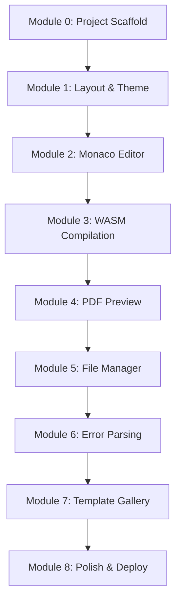

# Underleaf — Development & Branching Plan

This document outlines the step-by-step module-by-module build plan and the Git branching strategy to develop the **Underleaf** LaTeX editor.

---

## 1. Git Branching & PR Strategy

To maintain high code quality and clear history, we follow a strict branching model.

### Branch Types
* **`main`**: Production branch. Must always be stable and deployable.
* **`dev`**: Development integration branch. All feature branches merge here.
* **`feat/<feature-name>`**: For new features (e.g. `feat/monaco-setup`).
* **`fix/<issue-name>`**: For bug fixes (e.g. `fix/pdf-zoom`).
* **`docs/<topic-name>`**: For documentation changes (e.g. `docs/branching-plan`).

### PR & Merge Workflow (Via GitHub UI)
1. **Branch**: Always create branches from the latest `dev` branch.
   ```bash
   git checkout dev
   git pull origin dev
   git checkout -b <type>/<description>
   ```
2. **Commit**: Keep commits atomic with descriptive prefixes matching [CLAUDE.md](CLAUDE.md) guidelines:
   ```bash
   git commit -m "feat(editor): integrate monaco editor wrapper"
   ```
3. **Verify**: Before pushing, run linter and build tests using `/ul-validate`:
   ```bash
   npm run lint && npm run build
   ```
4. **Push & PR**: Push the branch and present PR details:
   ```bash
   git push -u origin <type>/<description>
   ```
   *AI assistants must print PR details and prompt the user to open the PR on GitHub.*
5. **Merge**: The repository owner reviews the PR on GitHub, verifies build/linter checks, and merges it into `dev` via GitHub UI.
6. **Release**: Periodically, `dev` is merged into `main` to trigger production deployments.

---

## 2. Module-by-Module Development Plan

Development is broken into 9 sequential, testable modules. Each module must compile and run before moving to the next.



### Module 0: Setup & Scaffolding
* **Tasks**:
  - Scaffold Vite React TS template: `npx create-vite-app` (non-interactive).
  - Configure ESLint, Prettier, and TypeScript compiler options.
  - Setup global store using **Zustand** (with mock file systems and compile-state structures).
* **Verification**: `npm run build` succeeds on clean setup.

### Module 1: Layout & Core Workspace UI
* **Tasks**:
  - Implement responsive split-pane screen layout using flexbox/grid.
  - **Desktop**: 3-column view (Sidebar | Editor | PDF Viewer).
  - **Tablet**: 2-column view with slide-out sidebar drawer.
  - **Mobile**: Single-column viewport with bottom tab bar switcher (`Edit` / `PDF` / `Files`).
  - Add the custom dark/light theme toggle.
* **Verification**: Verify responsiveness on mobile, tablet, and desktop viewports.

### Module 2: Monaco Editor Integration
* **Tasks**:
  - Install and configure `@monaco-editor/react`.
  - Add custom Monaco LaTeX Monarch tokens for syntax highlighting (mint green accents for commands, indigo for environment keywords).
  - Implement editor settings (font sizing, autocomplete popups, auto-closing brackets).
* **Verification**: Editor loads inside panel with code folding and custom colors.

### Module 3: SwiftLaTeX WASM Engine
* **Tasks**:
  - Setup WebAssembly files and worker hooks.
  - Integrate SwiftLaTeX compiler engine within a web worker thread.
  - Implement compiler triggers: Manual button compile, `Cmd/Ctrl+Enter` shortcut, and debounced typing auto-compile.
* **Verification**: Compile function is invoked and outputs a binary raw PDF Blob.

### Module 4: PDF Previewer
* **Tasks**:
  - Integrate `react-pdf` (PDF.js) into the preview column.
  - Feed compilation output PDF Blobs directly into the viewer.
  - Add page navigation (Prev/Next), percentage zoom controls, and a fit-to-screen toggle.
* **Verification**: PDF renders cleanly after compile commands trigger.

### Module 5: File Manager & Local Storage
* **Tasks**:
  - Implement a sidebar file tree (supporting folder structure, file creations, renames, and deletions).
  - Add file uploads (for `.tex`, `.bib`, and image assets).
  - Store project JSON payload in browser `localStorage`.
  - Add file size indicator warning user when approaching the 5MB browser quota.
* **Verification**: Created and uploaded files persist across browser reloads.

### Module 6: Error Log & Console
* **Tasks**:
  - Parse raw compiler output lines from SwiftLaTeX into structured error lists.
  - Display error console at the bottom of the editor screen.
  - Support clickable compiler errors (clicking a line number jumps the Monaco cursor to the offending line).
* **Verification**: Throw a compilation error in LaTeX and inspect logs to jump directly to the code error.

### Module 7: Template Gallery
* **Tasks**:
  - Populate starter packages (Blank document, CV/Resume, Academic article, Beamer slides, Cover letter).
  - Build landing page template carousel/grid to bootstrap new documents.
* **Verification**: Clicking a template cards launches the editor with the starter file structure fully loaded.

### Module 8: Production Polish & Hosting
* **Tasks**:
  - Optimize worker bundle resolution under production environments.
  - Setup static deployment config via Cloudflare Pages.
* **Verification**: Deploy project live to production link and test end-to-end.
