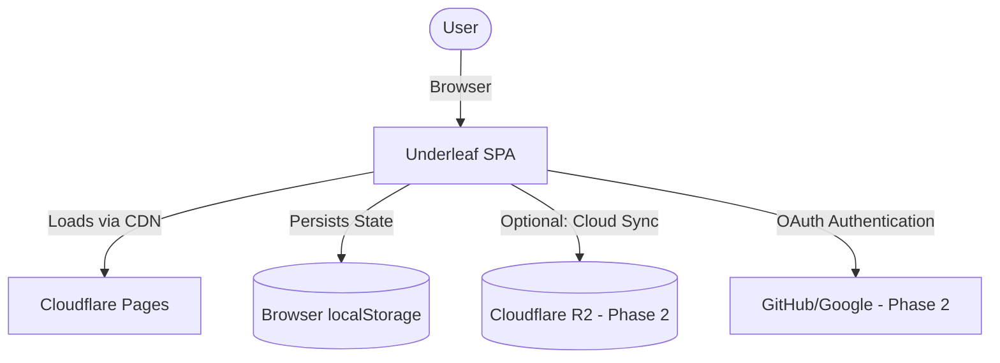
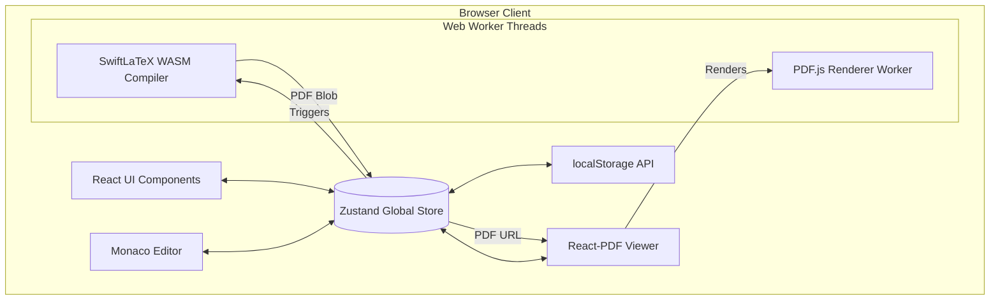
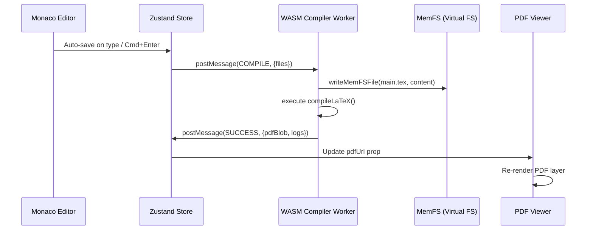
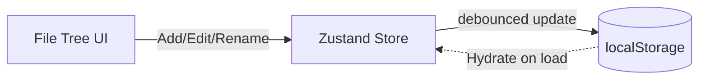
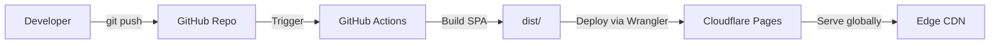

# High Level Architecture (HLA) - Underleaf

## 1. Executive Summary
Underleaf is a fully browser-based, zero-cost, open-source LaTeX editor. Unlike traditional collaborative LaTeX editors like Overleaf that rely on server-side compilation, Underleaf leverages WebAssembly (WASM) to execute the LaTeX engine (SwiftLaTeX/pdfTeX) entirely on the client side. This architecture guarantees absolute privacy, enables offline capabilities, and eliminates recurring backend computing costs, allowing the service to be hosted statically for free.

## 2. System Context Diagram

## 3. Architecture Principles
- **Zero-Cost Scalability:** The application must consist entirely of static assets (HTML/JS/CSS/WASM) hostable on CDNs. No persistent Node.js/Python backend for core functionality.
- **Privacy-First:** User documents and source code must never leave the browser unless explicitly synced to a user's cloud storage.
- **Offline-Capable:** Once the SPA and WASM binaries are cached, the core editor and compiler must function without an internet connection.
- **Responsive & Premium Aesthetics:** The UI must be highly responsive, utilizing modern glassmorphism, fluid animations, and robust CSS variable theming without heavy UI frameworks.

## 4. High-Level Component Diagram

## 5. Data Flow Diagrams

### 5.1 Compilation Flow

### 5.2 File Management Flow

## 6. Technology Stack
| Layer | Technology | Rationale |
| :--- | :--- | :--- |
| **Framework** | React 18 + Vite | Fast dev server, excellent ecosystem for SPA. |
| **Language** | TypeScript | Type safety for complex state and worker messaging. |
| **State** | Zustand | Lightweight, unopinionated, perfect for global editor state without context wrapping. |
| **Editor** | Monaco Editor | Industry standard, powerful APIs for custom LaTeX Monarch tokenization. |
| **Compiler** | SwiftLaTeX (WASM) | Compiles pdfTeX/XeTeX in browser, eliminating server costs. |
| **PDF Viewer** | react-pdf (PDF.js) | Standard for in-browser PDF rendering, supports worker threads. |
| **Styling** | Vanilla CSS + Vars | Maximum flexibility for glassmorphism, no Tailwind bloat. |

## 7. Deployment Architecture

## 8. Security & Privacy Model
- **Local Execution:** No source code is sent to any server for compilation.
- **XSS Protection:** React natively escapes string variables. User-generated content is only rendered inside the Monaco editor or parsed by the secure WASM engine.
- **Phase 2 (Cloud):** Any sync to Cloudflare R2 will require strict OAuth validation. Documents will be keyed by `userId/projectId`.

## 9. Performance Considerations
- **WASM Cold Start:** The SwiftLaTeX binary (~10-20MB) must be heavily cached via Service Workers or standard Cache-Control headers to ensure fast subsequent loads.
- **Worker Isolation:** The compiler and PDF renderer MUST run in dedicated Web Workers to prevent blocking the main UI thread during heavy typesetting or PDF parsing.
- **Virtualization:** For large PDFs, `react-pdf` must be configured to only render pages within the viewport.
- **Debouncing:** Editor state synchronization to Zustand and localStorage must be debounced (e.g., 500ms) to prevent performance degradation on every keystroke.

## 10. Phase 2 Architecture Extensions
- **Auth:** Cloudflare Workers handling OAuth2 flow (GitHub/Google).
- **Cloud Sync:** Cloudflare R2 object storage for backing up projects exceeding local storage limits.
- **Real-time Collaboration:** Yjs + WebRTC for peer-to-peer editing, falling back to a WebSocket signaling server for NAT traversal.

## 11. Comparison with Overleaf Architecture

| Feature | Overleaf (Community/Pro) | Underleaf |
| :--- | :--- | :--- |
| **Hosting** | Node.js Server + Docker TeX Containers | Cloudflare Pages (Static HTML/JS) |
| **Compiler Location** | Server-side | Client-side (Browser WebAssembly) |
| **Privacy** | Cloud-stored source files | Stored only on user's local device |
| **Offline Mode** | No | Yes |
| **Database** | MongoDB + Redis | localStorage (Phase 1) / R2 (Phase 2) |
| **Cost to Host** | High (Requires robust VPS for compilation) | Zero (Static hosting) |

## 12. Non-Functional Requirements
- **Latency:** Initial render < 1.5s. Hot re-compile (small document) < 500ms.
- **Browser Support:** Modern Chromium (Chrome, Edge), Firefox, Safari (versions supporting WASM and standard Web Workers).
- **Storage Limits:** Phase 1 relies on standard browser localStorage limits (~5MB per origin).
- **Accessibility:** Keyboard navigable UI, aria-labels for toolbar actions, high-contrast support via CSS theming.
