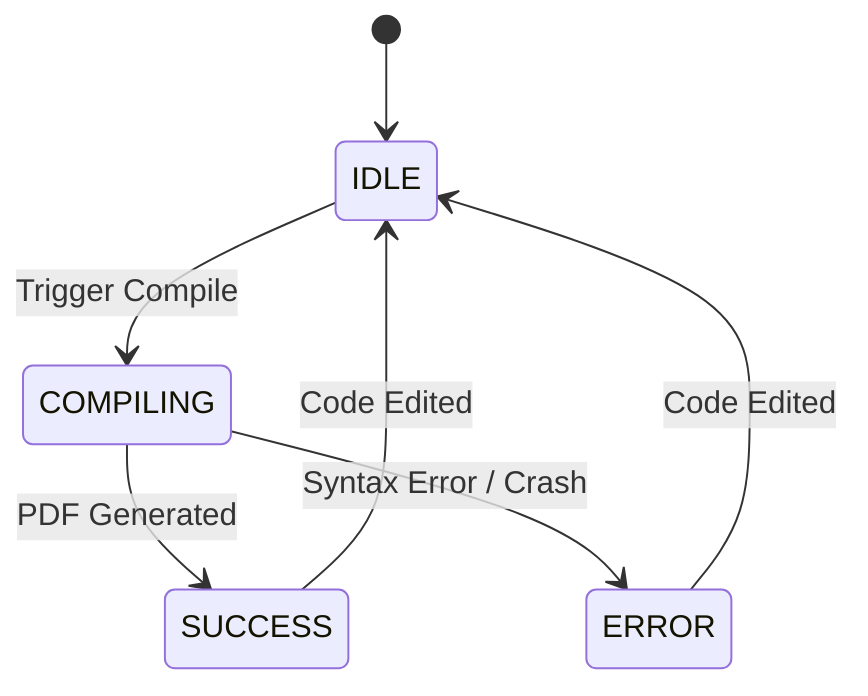

# Low Level Design (LLD) - Underleaf

## 1. Module Decomposition Overview
```mermaid
flowchart TD
    App[App.tsx] --> EditorLayout
    EditorLayout --> Sidebar[Sidebar (FileTree + TemplateGallery)]
    EditorLayout --> EditorPane[MonacoEditor]
    EditorLayout --> PreviewPane[PDFPreview]
    EditorLayout --> Toolbar
    EditorLayout --> ErrorLog
    
    App --> Store[(Zustand Store)]
    App --> CompilerSvc[CompilerService (Web Worker)]
    App --> StorageSvc[StorageService]
    App --> ThemeMgr[ThemeManager]
```

## 2. Detailed Module Designs

### 2.1 EditorLayout
- **Purpose:** Manages the responsive grid layout of the application.
- **Design:** Uses CSS Grid for defining areas (`sidebar`, `editor`, `preview`, `toolbar`, `logs`).
- **Features:** 
  - Draggable resize handles using a custom `useDraggable` hook modifying CSS variables for grid-template-columns.
  - Breakpoint logic: On mobile (`max-width: 768px`), collapses to a tabbed view (File / Editor / Preview) instead of side-by-side.
- **State Integration:** Reads `UIState.activePanel` to determine which tab to show on mobile.

### 2.2 MonacoEditor Wrapper
- **Purpose:** Integrates `@monaco-editor/react` with custom LaTeX grammar.
- **Design:**
  - **Tokenizer:** Custom Monarch language definition injected via `onMount`. Matches commands (`\\[a-zA-Z]+`), environments (`\\begin{...}`), inline math (`$...$`), block math (`\\[...\\]`), comments (`%...`).
  - **Autocomplete:** Registers a `completionItemProvider` containing 200+ common LaTeX commands, snippets (e.g., `itemize` block), and dynamically parses `\usepackage{}` to suggest package-specific commands.
  - **Shortcuts:** Binds `Cmd+Enter` (or `Ctrl+Enter`) to trigger a compilation action in the Store.
- **State Integration:** Controlled component bound to the currently selected file in `ProjectStore`. Debounces `onChange` events by 500ms before dispatching `updateFileContent`.

### 2.3 CompilerService (`src/engine/*` — Module 2)
- **Purpose:** Manages the SwiftLaTeX WASM binary. The engine already runs in its own Web Worker (shipped by SwiftLaTeX itself); we wrap it behind a thin `LatexEngine` interface.
- **Files:**
  - `src/engine/types.ts` — `LatexEngine`, `LatexCompileInput`, `LatexCompileResult`, `EngineStatus`.
  - `src/engine/swiftLatexEngine.ts` — Adapter. Lazily injects `<script src="/swiftlatex/PdfTeXEngine.js">`, instantiates `window.PdfTeXEngine`, calls `loadEngine()`, exposes `compile()`.
  - `src/engine/errorParser.ts` — pdfTeX log → `CompileError[]`.
  - `src/engine/index.ts` — `getLatexEngine()` singleton factory.
  - `src/hooks/useCompileTrigger.ts` — Mounted in `App.tsx`; subscribes to `compilationState.status`. When it flips to `COMPILING`, runs the engine and dispatches `setCompilationResult`.
- **Asset pipeline:** Engine WASM/JS lives in `public/swiftlatex/` (gitignored). `scripts/fetch-swiftlatex.mjs` (npm script `fetch:engine`) vendors them from the TeXlyre fork.
- **Vite dev headers:** `vite.config.ts` sets `Cross-Origin-Opener-Policy: same-origin` and `Cross-Origin-Embedder-Policy: require-corp` so SwiftLaTeX's `SharedArrayBuffer` works.
- **State flow:** `MonacoEditor` Ctrl+Enter → `setCompileStatus('COMPILING')` → `useCompileTrigger` effect → engine compile → `setCompilationResult(blobUrl, logs, errors)`.
- **State Machine:**


### 2.4 PDFPreview
- **Purpose:** Renders the compiled PDF.
- **Design:** 
  - Wraps `react-pdf`'s `<Document>` and `<Page>`.
  - Configures `GlobalWorkerOptions` to load `pdf.worker.min.mjs` locally.
  - **State:** Maintains local state for `scale` (zoom level, default 1.0, min 0.5, max 3.0) and `pageNumber`.
  - **Lifecycle:** When Store updates `pdfBlobUrl`, component revokes old URL (`URL.revokeObjectURL`) to prevent memory leaks and loads new URL.
  - **Layers:** Ensures both `TextLayer` and `AnnotationLayer` are loaded for text selection and link clicking.

### 2.5 FileTree
- **Purpose:** Sidebar component managing project structure.
- **Design:**
  - Renders files based on `Project.files` array.
  - Uses specific SVG icons for `.tex`, `.bib`, and image files.
  - Handles drag-and-drop for reordering or uploading files via HTML5 `FileReader` API (converts images to base64 for local storage or holds binary blob depending on size).
  - Context menu on right-click (Rename, Delete).

### 2.6 ErrorLog
- **Purpose:** Parses LaTeX build logs into actionable UI.
- **Design:**
  - Regex-based parser applied to raw `logs` string returned from CompilerService.
  - Extracts line numbers (`l.42`) and specific error messages (`Undefined control sequence`).
  - Renders a list of warnings/errors.
  - **Integration:** Clicking an error dispatches an event to MonacoEditor to jump the cursor to the specific line (`editor.revealLine`).

### 2.7 TemplateGallery
- **Purpose:** Provides starting points for users.
- **Design:**
  - Static JSON registry of templates (e.g., CV, Academic Paper, Letter).
  - UI presents a grid of template cards with preview thumbnails.
  - Selecting a template dispatches an action to completely overwrite the current `Project` in the store with template files.

### 2.8 ThemeManager
- **Purpose:** Handles application aesthetic state.
- **Design:**
  - Toggles CSS class `.dark-theme` on the `<html>` root element.
  - Defines two sets of CSS custom properties in `index.css`.
  - Detects `window.matchMedia('(prefers-color-scheme: dark)')` on initial load if no user preference is stored.

### 2.9 StorageService
- **Purpose:** Local persistence layer.
- **Design:**
  - Listens to Zustand store subscriptions. On change, debounces (1s) and serializes current `Project` to JSON via `localStorage.setItem('underleaf_project', json)`.
  - Implements quota checks before saving (browser limits ~5MB). Warns user if nearing limit.
  - Provides a utility to export the entire project as a `.zip` file using `jszip`.

### 2.10 Toolbar
- **Purpose:** Top navigation and action bar.
- **Design:**
  - Houses the main Compile button. Uses state (`status`) to show a spinning loader during compilation.
  - Download PDF button (triggers `<a>` download of current Blob URL).
  - Settings Modal trigger (adjust font size, toggle auto-compile).

## 3. Zustand Store Architecture
```typescript
interface RootStore {
  // Project State
  currentProject: Project;
  
  // UI State
  ui: UIState;
  
  // Compilation State
  compilation: CompilationState;
  
  // Settings
  settings: EditorSettings;

  // Actions
  setProject: (project: Project) => void;
  updateFileContent: (filename: string, content: string) => void;
  addFile: (file: ProjectFile) => void;
  deleteFile: (filename: string) => void;
  setCompileStatus: (status: CompileStatus, data?: any) => void;
  toggleTheme: () => void;
  setActivePanel: (panel: UIState['activePanel']) => void;
}
```

## 4. CSS Architecture
- **Methodology:** Vanilla CSS using custom properties (variables) for a rigorous design token system. No utility classes (Tailwind).
- **Naming:** BEM-inspired, prefixed with `ul-` (e.g., `ul-editor-pane`, `ul-btn--primary`).
- **Variables:** Defined in `:root`. Ex: `--color-surface`, `--color-accent`, `--font-primary`, `--spacing-md`, `--shadow-glass`.
- **Glassmorphism:** Achieved via mixins/utility classes applying `backdrop-filter: blur(10px); background: rgba(255, 255, 255, 0.1); border: 1px solid rgba(255, 255, 255, 0.2);`.

## 5. Error Handling Strategy
- **React Error Boundaries:** Top-level boundary to catch render crashes, displaying a friendly "Oops" screen. Module-level boundaries for Monaco and PDF Viewer to prevent one failing component from taking down the app.
- **WASM Crash Recovery:** If the Web Worker terminates unexpectedly (OOM), the CompilerService catches the termination event, shows an error toast, and attempts to spin up a new worker instance.

## 6. Testing Strategy
- **Unit Tests (Vitest):** Core utility functions, log parsers, and Zustand action mutators.
- **Component Tests (React Testing Library):** Button states, FileTree rendering, ErrorLog parsing UI.
- **Integration Tests:** The end-to-end flow of Store update -> CompilerService mock -> PDF Update.

## 7. File/Directory Structure
```text
src/
├── assets/            # Global images, fonts
├── components/        # UI Components
│   ├── editor/        # Monaco wrapper, syntax definitions
│   ├── preview/       # react-pdf wrappers, zoom controls
│   ├── sidebar/       # FileTree, TemplateGallery
│   ├── layout/        # EditorLayout, Toolbar, Resizer
│   └── shared/        # Buttons, Modals, Toasts
├── store/             # Zustand store definition
├── styles/            # CSS architecture
│   ├── variables.css  # Design tokens
│   ├── index.css      # Base styles
│   └── glass.css      # Glassmorphism utilities
├── types/             # TS interfaces (project.ts)
├── utils/             # Helper functions
│   ├── parser.ts      # LaTeX log regex parsers
│   └── storage.ts     # localStorage wrappers
├── workers/           # Web worker scripts
│   └── compiler.worker.ts
├── App.tsx            # Root component
└── main.tsx           # Entry point
```
