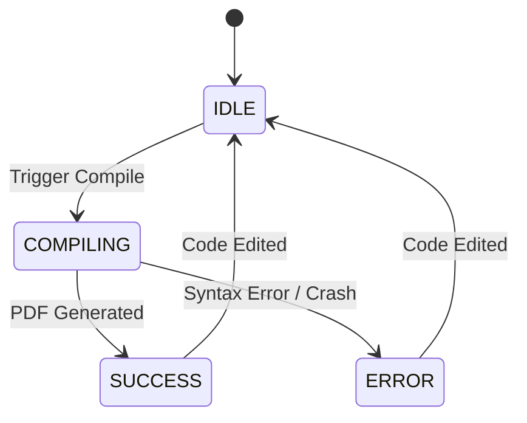

# Low Level Design (LLD) - Underleaf

## 1. Module Decomposition Overview
```mermaid
flowchart TD
    App[App.tsx] --> EditorLayout
    EditorLayout --> Sidebar[Sidebar (FileTree + TemplateGallery)]
    EditorLayout --> EditorPane[MonacoEditor]
    EditorLayout --> PreviewPane[PDFPreview]
    EditorLayout --> Toolbar
    EditorLayout --> ErrorLog
    
    App --> Store[(Zustand Store)]
    App --> CompilerSvc[CompilerService (Web Worker)]
    App --> StorageSvc[StorageService]
    App --> ThemeMgr[ThemeManager]
```

## 2. Detailed Module Designs

### 2.1 EditorLayout
- **Purpose:** Manages the responsive grid layout of the application.
- **Design:** Uses CSS Grid for defining areas (`sidebar`, `editor`, `preview`, `toolbar`, `logs`).
- **Features:** 
  - Draggable resize handles using a custom `useDraggable` hook modifying CSS variables for grid-template-columns.
  - Breakpoint logic: On mobile (`max-width: 768px`), collapses to a tabbed view (File / Editor / Preview) instead of side-by-side.
- **State Integration:** Reads `UIState.activePanel` to determine which tab to show on mobile.

### 2.2 MonacoEditor Wrapper
- **Purpose:** Integrates `@monaco-editor/react` with custom LaTeX grammar.
- **Design:**
  - **Tokenizer:** Custom Monarch language definition injected via `onMount`. Matches commands (`\\[a-zA-Z]+`), environments (`\\begin{...}`), inline math (`$...$`), block math (`\\[...\\]`), comments (`%...`).
  - **Autocomplete:** Registers a `completionItemProvider` containing 200+ common LaTeX commands, snippets (e.g., `itemize` block), and dynamically parses `\usepackage{}` to suggest package-specific commands.
  - **Shortcuts:** Binds `Cmd+Enter` (or `Ctrl+Enter`) to trigger a compilation action in the Store.
- **State Integration:** Controlled component bound to the currently selected file in `ProjectStore`. Debounces `onChange` events by 500ms before dispatching `updateFileContent`.

### 2.3 CompilerService (`src/engine/*` — Module 2)
- **Purpose:** Manages the SwiftLaTeX WASM binary. The engine already runs in its own Web Worker (shipped by SwiftLaTeX itself); we wrap it behind a thin `LatexEngine` interface.
- **Files:**
  - `src/engine/types.ts` — `LatexEngine`, `LatexCompileInput`, `LatexCompileResult`, `EngineStatus`.
  - `src/engine/swiftLatexEngine.ts` — Adapter. Lazily injects `<script src="/swiftlatex/PdfTeXEngine.js">`, instantiates `window.PdfTeXEngine`, calls `loadEngine()`, exposes `compile()`.
  - `src/engine/errorParser.ts` — pdfTeX log → `CompileError[]`.
  - `src/engine/index.ts` — `getLatexEngine()` singleton factory.
  - `src/hooks/useCompileTrigger.ts` — Mounted in `App.tsx`; subscribes to `compilationState.status`. When it flips to `COMPILING`, runs the engine and dispatches `setCompilationResult`.
- **Asset pipeline:** Engine WASM/JS lives in `public/swiftlatex/` (gitignored). `scripts/fetch-swiftlatex.mjs` (npm script `fetch:engine`) vendors them from the TeXlyre fork.
- **Vite dev headers:** `vite.config.ts` sets `Cross-Origin-Opener-Policy: same-origin` and `Cross-Origin-Embedder-Policy: require-corp` so SwiftLaTeX's `SharedArrayBuffer` works.
- **State flow:** `MonacoEditor` Ctrl+Enter → `setCompileStatus('COMPILING')` → `useCompileTrigger` effect → engine compile → `setCompilationResult(blobUrl, logs, errors)`.
- **State Machine:**


### 2.4 PDFPreview (`src/components/preview/PDFPreview.tsx` — Module 3)
- **Purpose:** Renders the compiled PDF from `compilationState.pdfBlobUrl`.
- **Loading:** `React.lazy` import inside `PreviewPlaceholder` keeps `react-pdf` (~423 KB) and the `pdf.worker` (~1 MB) out of the initial bundle. Main bundle stays at ~230 KB.
- **Worker:** `src/components/preview/pdfWorker.ts` is a side-effect module that sets `pdfjs.GlobalWorkerOptions.workerSrc` from `pdfjs-dist/build/pdf.worker.min.mjs?url` — bundled locally, no CDN.
- **State split:**
  - Outer `PDFPreview` owns `scale` (0.25–4.0, step 0.25), `fitWidth`, and the `ResizeObserver`-derived `containerWidth`. These survive across `file` changes.
  - Inner `DocPane` is `key={file}`-ed so `pageNumber`, `pageCount`, and `loadError` reset cleanly on file change without violating React 19's "no setState during render" rule.
- **Toolbar:** Prev/next page, page input, page count, zoom in/out/reset, fit-width toggle. Lucide icons; vanilla CSS in `PDFPreview.css`.
- **Blob URL lifecycle:** Old URL revocation lives in `SwiftLatexEngine.trackBlobUrl()` (Module 2), not here — preview is pure consumer.
- **Text/Annotation layers:** Both enabled so text selection and link clicks work.

### 2.5 FileTree (`src/components/sidebar/FileTree.tsx` — Module 4)
- **Purpose:** Sidebar file browser. Replaces the placeholder body of `SidebarPlaceholder` (filename preserved so `EditorLayout` doesn't change).
- **Operations:** Click `.tex` row → store `setMainFile`; New file via inline form (Enter to commit, Esc to cancel; dedupes via existing `createFile` behavior + inline error); Right-click row → contextual Rename/Delete; Delete uses `window.confirm`.
- **Icons:** Lucide — `FileCode` (tex), `BookText` (bib), `Image` (image), `FileText` (other).
- **Capacity footer:** Reads `useProjectSizeUsage()`. Renders bytes + percent + bar; turns warning at >80 %, danger at >100 %.
- **State:** All mutations route through Zustand actions (`setMainFile`, `createFile`, `renameFile`, `deleteFile`). FileTree owns only local editing/menu state.

### 2.5b Persistence (`src/persistence/localProject.ts` + `src/hooks/useProjectPersistence.ts` — Module 4)
- **Storage key:** `underleaf.project.v1` in `localStorage`.
- **Quota:** 5 MB upper bound. `estimatePayloadBytes` returns `JSON.stringify(project).length * 2` (UTF-16). `saveProject` refuses to write when over quota — the prior good copy stays intact.
- **Hook:** `useProjectPersistence()` mounted in `App.tsx`. On first render, hydrates from storage if present. On every `currentProject` change, debounces 300 ms and calls `saveProject`. Hydration runs before any save attempt so a saved project overrides the in-memory default.
- **Size selector:** `useProjectSizeUsage()` returns `{ bytes, limit, usagePercent }`. `FileTree` footer subscribes to it.

### 2.6 ErrorLog
- **Purpose:** Parses LaTeX build logs into actionable UI.
- **Design:**
  - Regex-based parser applied to raw `logs` string returned from CompilerService.
  - Extracts line numbers (`l.42`) and specific error messages (`Undefined control sequence`).
  - Renders a list of warnings/errors.
  - **Integration:** Clicking an error dispatches an event to MonacoEditor to jump the cursor to the specific line (`editor.revealLine`).

### 2.7 TemplateGallery
- **Purpose:** Provides starting points for users.
- **Design:**
  - Static JSON registry of templates (e.g., CV, Academic Paper, Letter).
  - UI presents a grid of template cards with preview thumbnails.
  - Selecting a template dispatches an action to completely overwrite the current `Project` in the store with template files.

### 2.8 ThemeManager
- **Purpose:** Handles application aesthetic state.
- **Design:**
  - Toggles CSS class `.dark-theme` on the `<html>` root element.
  - Defines two sets of CSS custom properties in `index.css`.
  - Detects `window.matchMedia('(prefers-color-scheme: dark)')` on initial load if no user preference is stored.

### 2.9 StorageService
**Superseded by §2.5b Persistence (Module 4)**. Zip export remains a future module. Keep this entry as a pointer.

### 2.11 ResumeData (`src/types/resume.ts` — Module 5)
- Typed schema for the structured-mode resume payload.
- Sections: `basics`, `work[]`, `education[]`, `projects[]`, `skills[]` (grouped category → items), optional `awards[]`.
- Loosely inspired by JSON Resume, deliberately simpler — TypeScript is the only validator for now; zod arrives with the Module 7 form editor.

### 2.12 TemplateRenderer (`src/templates/*` — Modules 5–6)
- Interface: `{ id, name, description, render(data: ResumeData): { mainTex, files: ProjectFile[] } }`.
- Registry in `src/templates/index.ts` keyed by id; `getTemplate(id)` lookup, `listTemplates()` enumeration, `DEFAULT_TEMPLATE_ID` (= `jakes-resume`) for new projects.
- Templates shipped (Module 6 added the latter three):
  - **`jakes-resume`** — single column, ATS-friendly; `geometry` + `enumitem` + `hyperref` + `titlesec`.
  - **`deedy-cv`** — two-column via `minipage`; skills/education left, experience/projects right.
  - **`awesome-cv`** — single column with `xcolor` accent on name + section headers.
  - **`rendercv-modern`** — minimalist, `parskip` spacing, small-caps lowercase section headers, side dates.
- All user content runs through `escapeLatex` (single-pass char-class regex — never double-escapes braces emitted by other replacements).
- Sample fixture in `src/templates/sampleResume.ts` is seeded when a user first switches to structured mode.

### 2.15 LLM client (`src/llm/*` — Module 7)
- `LLMClient` interface: `complete({ system?, user, model?, temperature? }): Promise<{ text, raw }>`.
- Adapters: `createGeminiClient` (Google Gemini, `v1beta` `generateContent`, browser-callable with `key=`), `createOllamaClient` (local `${host}/api/chat`, default `http://localhost:11434`).
- `getLLMClient(settings)` factory; `LLM_PROVIDERS` registry with display names, default model, suggested models, BYO-key flag.
- Settings persistence in `src/persistence/llmSettings.ts` under `underleaf.llm.v1` — **separate from the project payload**.
- Store slice: `llmSettings: { provider, model, apiKey?, ollamaHost? }` + `setLlmSettings(patch)`.
- App.tsx hydrates settings on mount and saves on every change (no debounce — the slice is small and rarely written).

### 2.16 AI Assistant (`src/ai/*` + `src/components/ai/*` — Module 7)
- `src/ai/atsHints.ts` — pure heuristic checks (no LLM). Flags missing summary/email/work/skills, weak verbs, bullets without metrics, bullets > 35 words. Returns `AtsHint[]` with `severity: info|warning|error`.
- `src/ai/jdMatcher.ts` — calls the configured LLM with a strict-JSON system prompt; tolerates `\`\`\`json` fences and a leading sentence; clamps `score` into 0–100; drops malformed suggestion entries; throws with `cause` on parse failure.
- `AssistantDrawer.tsx` — right-side slide-in. Three tabs: ATS Hints, JD Match, Settings. Esc closes; backdrop click closes; focus returns to FileTree trigger.
- `AtsHintsPanel`, `JdMatchPanel`, `LlmSettingsPanel` are dumb panel components. JdMatchPanel disables Analyze unless `isProviderConfigured(llmSettings)` returns true. LlmSettingsPanel has a "Test connection" button that sends a 1-word ping.
- **Gating:** in `raw` mode the drawer shows a stub explaining that AI features run on structured `resume` data; the Settings tab still works so users can configure providers early.

### 2.17 AI rewrite + apply path (Modules 5–8)
- `src/ai/applySuggestion.ts` — exact-match locator that takes a `JdSuggestion` plus a `ResumeData`, finds the matching bullet in `work[*].highlights[*]`, and returns either `{ ok: true, resume, workIndex, highlightIndex }` or `{ ok: false, reason }`. Pure function; idempotent (second apply against same bullet fails with `not found`).
- `src/ai/rewriteForImpact.ts` — pure async helper. Takes a line of text + an `LLMClient`, returns the rewrite. Strips wrapping quotes, list markers, and common preamble ("Output:", "Rewrite:"). Returns the input on empty LLM output (no flicker).
- `MonacoEditor` registers an action `underleaf.rewriteForImpact` (id, label "Underleaf: Rewrite for impact", `Cmd/Ctrl + Alt + R`, context-menu group `1_modification`). It captures the selection or the current line, calls the LLM via the existing settings, and replaces the range. While in flight the editor header shows `rewriting…`; on error the header shows the message for 4 seconds and the text is untouched.
- `MonacoEditor` in **structured mode** swaps to a `JSON.stringify(resume, null, 2)` virtual document with `language: 'json'`. Edits debounce-call `setResume(parsed)` on valid JSON; invalid JSON keeps the prior store value and surfaces `JSON: …` in the editor header in danger color.
- `JdMatchPanel` extends with an **Apply** button per suggestion that calls `applySuggestion` + `setResume`. Applied state is per-analysis (resets on Analyze).

### 2.14 TemplatePickerModal (`src/components/templates/TemplatePickerModal.tsx` — Module 6)
- Modal listing every registered template as a card (name + description + selected badge).
- Opens from FileTree footer "Browse templates" button. Esc / backdrop click closes; focus returns to trigger.
- Picking a template:
  - In `raw` mode: calls `setProjectMode('structured', sampleResume, id)` — auto-switches and seeds.
  - In `structured` mode: calls `setTemplate(id)` only.
- Keyboard-accessible: first card receives focus on open; Esc closes.
- No thumbnails yet (deferred — would require server-side or cached PDF render).

### 2.13 Dual-mode Project (Module 5)
- `Project.mode: 'raw' | 'structured'` with optional `resume: ResumeData` and `templateId: string` companions.
- Store actions added: `setProjectMode(mode, seedResume?, seedTemplateId?)`, `updateResume(patch)`, `setTemplate(id)`, `ejectToRaw()`.
- `ejectToRaw` is one-way: renders the resume via the current template into `files[]`, sets `mainFile = 'main.tex'`, flips `mode = 'raw'`, clears `resume` + `templateId`.
- `loadProject()` in `src/persistence/localProject.ts` normalises legacy saves (`mode ??= 'raw'`).
- `useCompileTrigger` branches on `mode`: in `structured`, it calls `template.render(resume)` and feeds the generated `main.tex` + companion files to the engine; in `raw`, the existing path is unchanged.
- FileTree footer exposes a toggle: "Switch to structured" (seeds from `sampleResume` + `jakes-resume`) or "Eject to raw .tex" (calls `ejectToRaw`).

### 2.10 Toolbar
- **Purpose:** Top navigation and action bar.
- **Design:**
  - Houses the main Compile button. Uses state (`status`) to show a spinning loader during compilation.
  - Download PDF button (triggers `<a>` download of current Blob URL).
  - Settings Modal trigger (adjust font size, toggle auto-compile).

## 3. Zustand Store Architecture
```typescript
interface RootStore {
  // Project State
  currentProject: Project;
  
  // UI State
  ui: UIState;
  
  // Compilation State
  compilation: CompilationState;
  
  // Settings
  settings: EditorSettings;

  // Actions
  setProject: (project: Project) => void;
  updateFileContent: (filename: string, content: string) => void;
  addFile: (file: ProjectFile) => void;
  deleteFile: (filename: string) => void;
  setCompileStatus: (status: CompileStatus, data?: any) => void;
  toggleTheme: () => void;
  setActivePanel: (panel: UIState['activePanel']) => void;
}
```

## 4. CSS Architecture
- **Methodology:** Vanilla CSS using custom properties (variables) for a rigorous design token system. No utility classes (Tailwind).
- **Naming:** BEM-inspired, prefixed with `ul-` (e.g., `ul-editor-pane`, `ul-btn--primary`).
- **Variables:** Defined in `:root`. Ex: `--color-surface`, `--color-accent`, `--font-primary`, `--spacing-md`, `--shadow-glass`.
- **Glassmorphism:** Achieved via mixins/utility classes applying `backdrop-filter: blur(10px); background: rgba(255, 255, 255, 0.1); border: 1px solid rgba(255, 255, 255, 0.2);`.

## 5. Error Handling Strategy
- **React Error Boundaries:** Top-level boundary to catch render crashes, displaying a friendly "Oops" screen. Module-level boundaries for Monaco and PDF Viewer to prevent one failing component from taking down the app.
- **WASM Crash Recovery:** If the Web Worker terminates unexpectedly (OOM), the CompilerService catches the termination event, shows an error toast, and attempts to spin up a new worker instance.

## 6. Testing Strategy
- **Unit Tests (Vitest):** Core utility functions, log parsers, and Zustand action mutators.
- **Component Tests (React Testing Library):** Button states, FileTree rendering, ErrorLog parsing UI.
- **Integration Tests:** The end-to-end flow of Store update -> CompilerService mock -> PDF Update.

## 7. File/Directory Structure
```text
src/
├── assets/            # Global images, fonts
├── components/        # UI Components
│   ├── editor/        # Monaco wrapper, syntax definitions
│   ├── preview/       # react-pdf wrappers, zoom controls
│   ├── sidebar/       # FileTree, TemplateGallery
│   ├── layout/        # EditorLayout, Toolbar, Resizer
│   └── shared/        # Buttons, Modals, Toasts
├── store/             # Zustand store definition
├── styles/            # CSS architecture
│   ├── variables.css  # Design tokens
│   ├── index.css      # Base styles
│   └── glass.css      # Glassmorphism utilities
├── types/             # TS interfaces (project.ts)
├── utils/             # Helper functions
│   ├── parser.ts      # LaTeX log regex parsers
│   └── storage.ts     # localStorage wrappers
├── workers/           # Web worker scripts
│   └── compiler.worker.ts
├── App.tsx            # Root component
└── main.tsx           # Entry point
```
