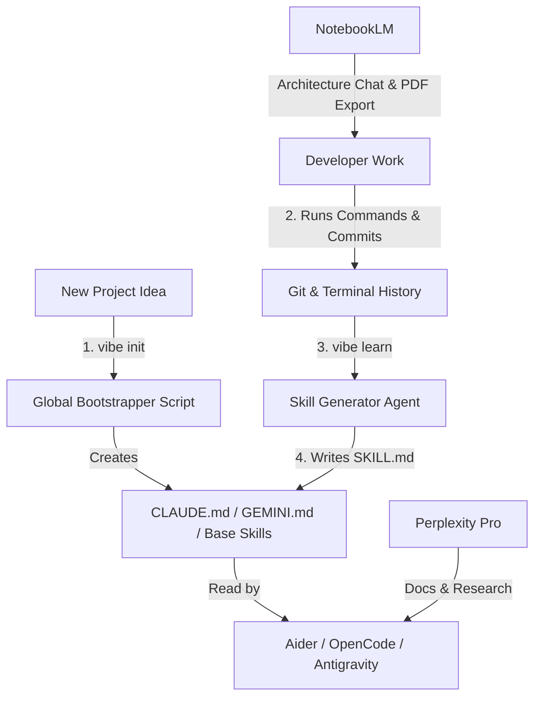

# The Vibe-Coding Agentic Toolchain & Memory Loop
*A strategic blueprint to automate project bootstrapping, record agent skills, and orchestrate open-source developer tooling.*

---

## 1. The Core Philosophy: "Continuous Integration of Intent"

When you **vibe code**, your primary currency is **intent** (what you want to build) rather than **syntax** (how to write the lines of code). To prevent starting from scratch on every project, you need a system that captures this intent, structures it as a persistent context, and lets your AI tools read and write to it dynamically.

By combining the Hermes "learning loop" philosophy with your existing tool stack, you can create a unified workflow:



---

## 2. Bootstrapping Your Tool Stack

You currently have a highly complementary set of tools. Here is how to divide and conquer using them:

### 🔍 Perplexity Pro (The Researcher)
*   **Purpose:** Web search, library lookup, API documentation, and debugging weird compiler/module errors.
*   **Workflow:** Use Perplexity to figure out *what* libraries to use or how a specific API behaves. Feed its raw markdown output directly into your terminal tools.

### 📚 NotebookLM (The Codebase Digest)
*   **Purpose:** Deep, high-context comprehension of your active codebases.
*   **Workflow:** 
    1. Export your project directory as a single Markdown file (or a folder of key files).
    2. Upload it to NotebookLM as a source.
    3. Use it to generate user guides, chat about architectural patterns, or map out dependencies without burning OpenRouter tokens.

### 👥 Aider (The Surgical Editor)
*   **Purpose:** Targeted code generation, refactoring specific files, and rapid bug-fixing.
*   **Workflow:** Run Aider with local Ollama models (`aider-lc-*`) or OpenRouter keys for daily-driver coding tasks. It keeps your Git history clean by committing changes automatically.

### 🛠️ OpenCode (The Autonomous Agent)
*   **Purpose:** High-level agentic loops, executing build commands, running test suites, and refactoring directories.
*   **Workflow:** Launch OpenCode with OpenRouter (`oc-qwen3-free`) when you want to delegate a multi-step task like: *"Create the entire database model layer and ensure the build passes."*

### 🌌 Antigravity (The Architect & Orchestrator)
*   **Purpose:** Multi-agent collaboration, designing implementation blueprints, and managing project-wide task lists.

---

## 3. Designing a "Local Memory Loop" (LAML)

To implement the Hermes philosophy (learning and creating skills based on repetitive tasks), you can build a lightweight command-line script called `vibe`. Here is how it can be structured:

### A. The Bootstrapper (`vibe init`)
Instead of copying files manually, create a global script in your local bin directory (e.g., `/Users/mrrobot/.local/bin/vibe`) that scaffolds a new repository with:
1.  **Vibe Code Configs:** A standard [CLAUDE.md](file:///Users/mrrobot/Desktop/Projects/underleaf/CLAUDE.md) containing your Karpathy rules (Think before coding, Simplicity first, Surgical changes, Goal-driven execution) and Git commit rules.
2.  **Base Styling Tokens:** A core CSS variables template featuring your glassmorphism theme.
3.  **Essential Skills:** Default skills pre-loaded into `.gemini/skills/` (like `/validate` and `/add-component`).

### B. The Skill Learner (`vibe learn`)
When you perform a repetitive task (e.g., setting up a specific database connection, deploying to Vercel, or registering a route), you can run:
```bash
vibe learn "how to deploy this project to vercel"
```

This command triggers a simple prompt to your OpenRouter/Gemini API key that:
1.  Reads the last 10 commands from your terminal history.
2.  Reads the latest git diff or commit message.
3.  Synthesizes a new markdown skill file (`SKILL.md`) in the correct format.
4.  Saves it directly to `.gemini/skills/ul-deploy/SKILL.md`.

Now, your AI agents (Aider, OpenCode, etc.) instantly know exactly how to execute this task in the future.

---

## 4. Practical Implementation: A Shell Script

Here is an example shell script you can add to your environment to start automating this.

Create a file named `vibe` at `/Users/mrrobot/.local/bin/vibe`:

```bash
#!/bin/bash

case "$1" in
  init)
    PROJECT_NAME=$2
    if [ -z "$PROJECT_NAME" ]; then
      echo "Usage: vibe init <project-name>"
      exit 1
    fi
    echo "🚀 Bootstrapping vibe coding project: $PROJECT_NAME..."
    mkdir -p "$PROJECT_NAME/.gemini/skills/ul-validate"
    
    # Create default CLAUDE.md
    cat <<EOT > "$PROJECT_NAME/CLAUDE.md"
# CLAUDE.md — $PROJECT_NAME
## Working Agreement (Karpathy Skills)
1. Think before coding.
2. Simplicity first.
3. Surgical changes.
4. Goal-driven execution.
EOT

    # Create default validate skill
    cat <<EOT > "$PROJECT_NAME/.gemini/skills/ul-validate/SKILL.md"
---
name: ul-validate
description: Run codebase validation.
trigger: /ul-validate
---
# Skill: /ul-validate
1. Run linting command.
2. Run build verification.
EOT

    echo "✅ Project $PROJECT_NAME initialized with CLAUDE.md and base validation skills."
    ;;

  learn)
    SKILL_NAME=$2
    if [ -z "$SKILL_NAME" ]; then
      echo "Usage: vibe learn <skill-name>"
      exit 1
    fi
    echo "🧠 Analyzing terminal history and generating skill: $SKILL_NAME..."
    # 1. Read command history
    HIST=$(fc -ln -50) # get last 50 commands
    
    # 2. Call Gemini Pro or OpenRouter to synthesize a SKILL.md
    # (Write a lightweight python/node script to call the API and write .gemini/skills/$SKILL_NAME/SKILL.md)
    ;;

  *)
    echo "Vibe Coding Helper"
    echo "Usage: vibe [init|learn]"
    ;;
esac
```

---

## 5. Next Steps for Underleaf

As you vibe code [underleaf](file:///Users/mrrobot/Desktop/Projects/underleaf):
1.  **Keep `CLAUDE.md` and `GEMINI.md` current:** Treat them as the "long-term memory" of your AI agents. If you make a design system decision, update them immediately.
2.  **Use `/ul-validate`:** Let your terminal tools run the linter and build loop before you review any code changes.
3.  **Save your prompts:** When Perplexity Pro gives you an excellent solution for the SwiftLaTeX WASM engine, save the prompt or script in a scratch folder or document it directly in `CLAUDE.md`.
