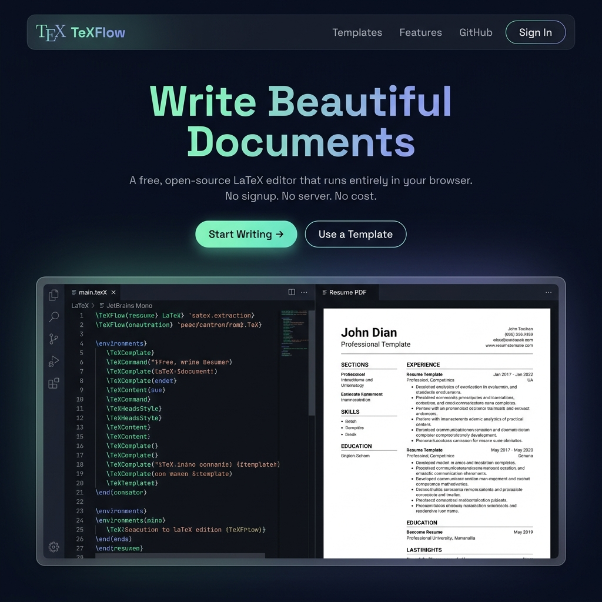
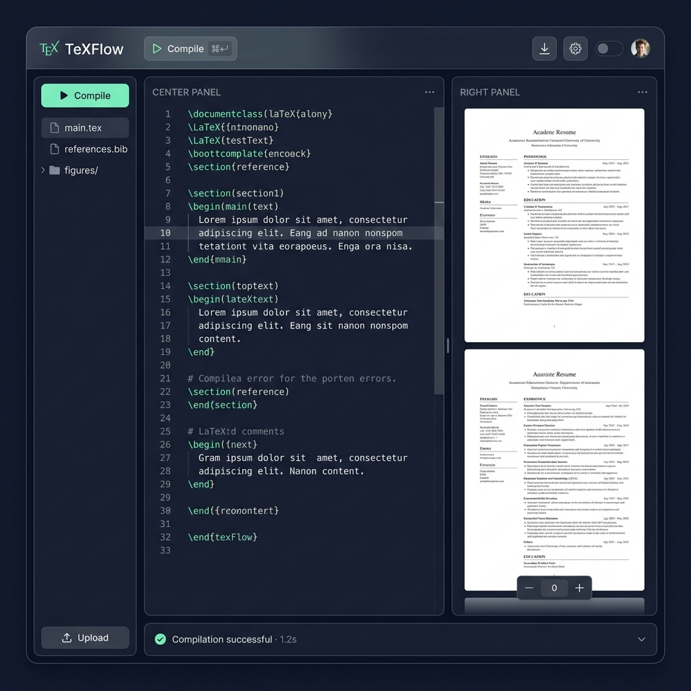
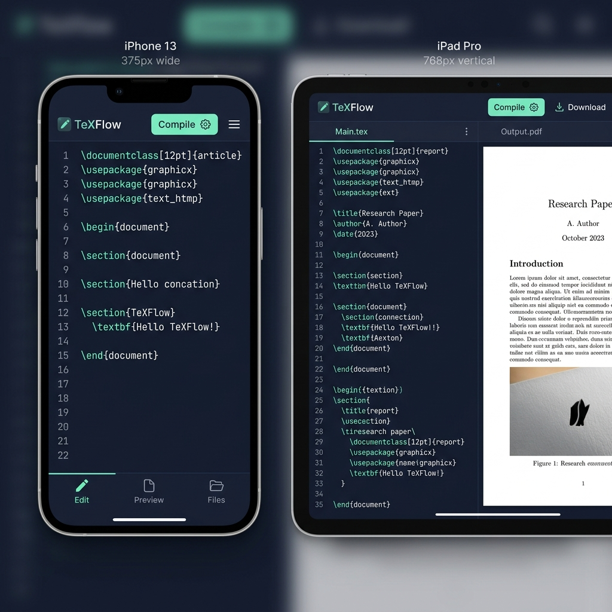

# Underleaf — Design Summary

> **Status**: Design Phase · $0/month hosting · 100% browser-based

---

## Visual Design Mockups

````carousel

<!-- slide -->

<!-- slide -->

````

---

## Why $0/Month is Achievable

| What | How | Cost |
|------|-----|------|
| LaTeX compilation | **WASM (pdfTeX) runs in the user's browser** — no server needed | **$0** |
| Hosting | **Cloudflare Pages** — unlimited bandwidth, global CDN | **$0** |
| Anonymous storage | Browser `localStorage` | **$0** |
| Auth (optional) | Cloudflare Workers (100k req/day free) | **$0** |
| Cloud save (optional v2) | Cloudflare R2 (~$0.015/GB) | **~$0** |
| **Total** | | **$0/month** |

> [!IMPORTANT]
> Compilation happens entirely in the **user's browser** using WebAssembly (WASM). The LaTeX source code **never leaves their device**. This is also a strong privacy + trust feature to market.

---

## Visual Identity

| Element | Decision |
|---------|---------|
| **Brand name** | Underleaf |
| **Primary color** | Mint green `#6EE7B7` |
| **Secondary color** | Soft indigo `#818CF8` |
| **Background** | Deep navy `#0A0E1A` |
| **Default theme** | Dark mode (light mode toggle available) |
| **Heading font** | Space Grotesk |
| **UI font** | Inter |
| **Code font** | JetBrains Mono |
| **Design language** | Glassmorphism panels, gradient CTAs, micro-animations |

---

## Core Features (v1 Design)

| Feature | Design Notes |
|---------|-------------|
| 🖊️ Monaco Editor | Full VS Code-quality editor, LaTeX syntax highlighting, 200+ autocomplete commands |
| ⚡ Compile | `Cmd+Enter` shortcut, live spinner animation, "first load" notice for WASM |
| 📄 PDF Preview | Side-by-side viewer with zoom + page controls |
| 📁 File Manager | Upload `.tex`, `.bib`, `.png`, `.jpg` files; create/rename/delete |
| 🗒️ Error Log | Collapsible bottom panel, clickable line references |
| 📥 Download | One-click PDF download |
| 📋 Templates | Resume, Article, Beamer Slides, Cover Letter, Blank |
| 🌓 Dark/Light | Toggle in toolbar, remembered across sessions |
| 📱 Responsive | Full 3-panel desktop → 2-panel tablet → tab-switcher mobile |
| 👤 Auth (v1) | Anonymous (localStorage) + optional GitHub/Google login |

---

## Responsive Layout Design

```
Desktop (≥1024px):  [File Tree | Editor | PDF Preview]  ← 3 panels, resizable
Tablet  (768-1024px): [Editor | PDF Preview]  + File drawer
Mobile  (<768px):   [Single Panel] + bottom tabs (Edit / Preview / Files)
```

---

## Tech Stack (Decided)

```
Frontend:   React 18 + Vite
Editor:     Monaco Editor (@monaco-editor/react)
PDF:        react-pdf (PDF.js)
LaTeX:      SwiftLaTeX WASM (pdfTeX in browser)
State:      Zustand
CSS:        Vanilla CSS + Custom Properties
Hosting:    Cloudflare Pages (free)
Auth (v2):  Cloudflare Workers + GitHub OAuth
Storage(v2):Cloudflare R2
```

---

## Open Design Questions

> [!NOTE]
> Please review and share your thoughts on these before we move to the build phase:

1. **Logo**: Simple wordmark (text only) or an icon too (e.g., a custom logo concept)?
2. **Templates for v1**: Resume + Article + Beamer + Cover Letter + Blank — enough, or add more?
3. **Domain**: Use free `.pages.dev` subdomain, or purchase a custom domain?
4. **Color palette**: Do you like the mint green + indigo + deep navy direction?
5. **Start building?** Once design is approved, I can scaffold the full project.

---

## Full Design Document

See the detailed design doc: [implementation_plan.md](implementation_plan.md)
